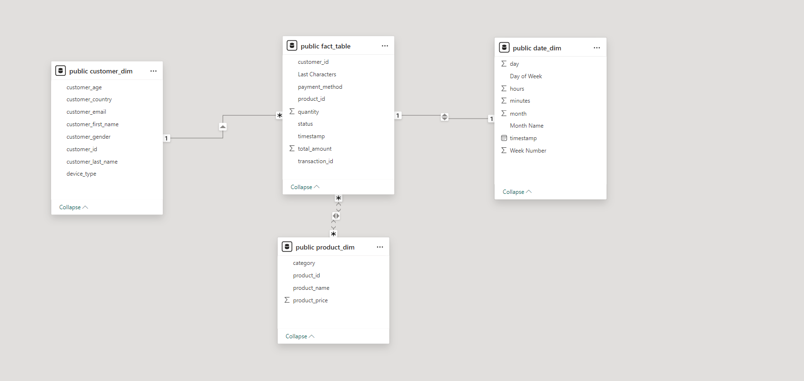

# Real-Time-Data-Pipeline-for-E-Commerce-Analytics

This project demonstrates the implementation of a real-time data processing pipeline for an e-commerce platform. The pipeline leverages Kafka for real-time data ingestion, Apache Spark Streaming for real-time data transformation, and PostgreSQL as the data warehouse to store structured data. The pipeline is designed to process e-commerce transactions, providing timely insights into customer activities, product performance, and sales metrics.

And this is the workflow for this project

1. Data Generation & Ingestion:
    Data Generation: Generates synthetic e-commerce transaction data, simulating real-time activities like product purchases, user interactions, and transaction details.
    Kafka: Utilizes Kafka to ingest the generated data in real-time. Kafka ensures that the data stream is fault-tolerant, scalable, and provides high-throughput, which is crucial for handling large volumes of e-              commerce transactions.

2. Data Processing with Spark Streaming:
        Apache Spark Streaming: The real-time data is processed using Spark Streaming. Spark processes the incoming data in micro-batches and performs necessary transformations, including:
               Transformation: Changing columns data types, creating new columns 
               Constructing data warehouse tables
3. Data Modeling:
        Data Warehouse: A star schema is created for efficient querying and analytics. The data model consists of:
              Fact Table: Stores transaction-level data, including product details, quantities, and prices.
              Dimension Tables: Include tables for products, customers, and time, to provide context for the transactions.

   This is the star schema for the data warehouse
   

   PostgreSQL: Data is stored in a PostgreSQL database for persistence. The schema is optimized for querying the e-commerce data efficiently and is integrated with the real-time pipeline for constant updates.

4. Real-Time Reporting & Visualization
    Power BI: The processed data is sent to Power BI for real-time dashboards. The dashboard is updated every hour, providing insights into:
          Product performance (e.g. , which products are the most popular).
          Customer behavior (e.g. ,purchase trends over time).
          Financial metrics (e.g. ,total sales, average order value).

   and these are pictures from the dashboard
   

      
      
      
      
   

   
